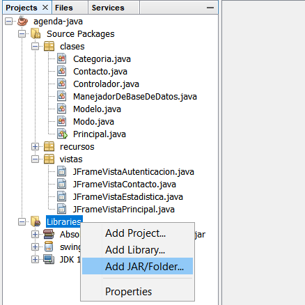

# Agenda

Agenda electrónica persistente que permite agregar, modificar, borrar, filtrar y ver estadísticas de contactos. Realizado con **Java Swing** utilizando el patrón MVC y base de datos **MySQL**.

## Base de datos de contactos

Es necesario tener operativa la base de datos **agenda**.

Verificar la clave de superusuario **root**. Por defecto, en la aplicación la clave es "**root**".

### Para importar la base de datos:

Las siguientes instrucciones muestran los pasos a seguir utilizando el software *MySQL Workbench*, aunque también es posible importar la base de datos usando *PHPMyAdmin* o la consola.

1. En MySQL Workbench, ir al menú *Server* y seleccionar la opción *Data Import*.
2. Marcar el modo *Import from Self-Contained File* y seleccionar el archivo **agenda.sql**. [*DESCARGAR DESDE AQUI*](https://drive.google.com/open?id=1SmhXQi2XjxdBeHvz9PMuP9OYBHSc2LwI)
3. Presionar *Start import* y esperar el mensaje *Import complete*.
4. En el listado de *schemas*, presionar con el botón derecho y elegir la opción *Refresh All*.
5. Verificar que haya una tabla llamada **contactos** con registros dentro.

## Driver para MySQL
### (Solo necesario para la v0. En las siguientes ya se incluye)

Para poder conectar una aplicación Java con una base de datos MySQL, es necesario contar con el driver correspondiente y añadirlo al proyecto, según las siguientes instrucciones:

1. Abrir el proyecto en Netbeans y ubicar la carpeta *Libraries*.
2. Hacer click derecho y elegir la opcion *Add JAR/Folder*
3. Elegir el archivo **mysql-connector-java-5.1.42-bin.jar** incluido en la carpeta de este proyecto.

