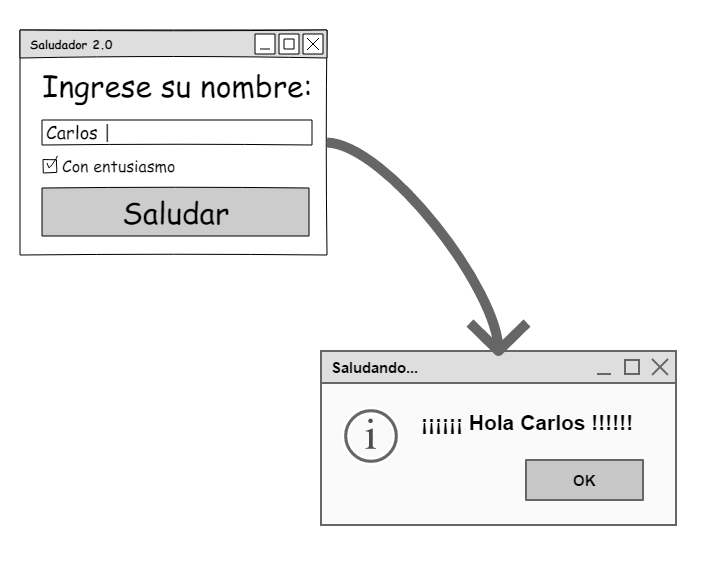

# Saludador

Pequeña app de introducción a las interfaces gráficas de usuario (GUIs).

## Demostración de la interfaz gráfica

El usuario ingresa su nombre y presiona el botón *"Saludar"*. La app responde con un diálogo que muestra un saludo. Si se activa la opción *"Con entusiasmo"*, el saludo es más llamativo.

