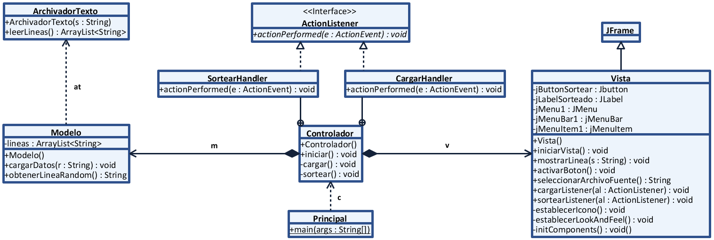
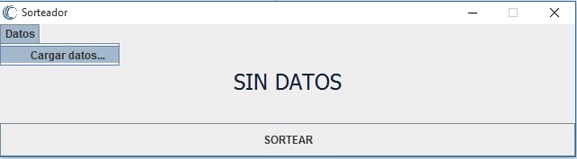

# Sorteador

Sorteador de cadenas de texto, obtenidas mediante un archivo .txt. Realizado con **Java** Swing utilizando el patrón MVC.

## Diagrama de clases

## Demostración de la interfaz gráfica

